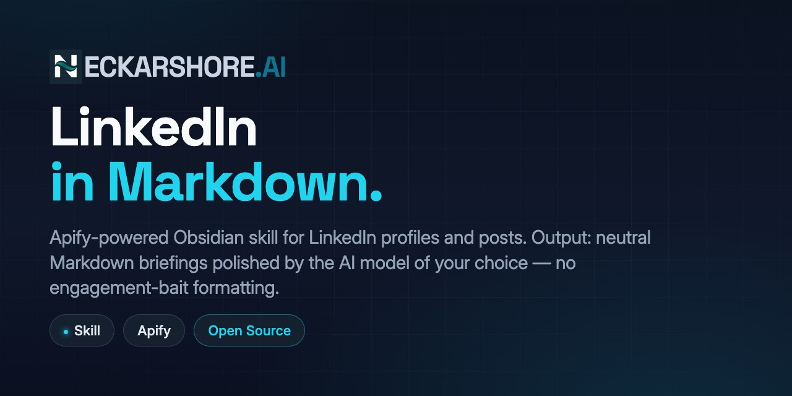

# obsidian-linkedin-scraper

  

Obsidian skill for LinkedIn profiles and posts via Apify. Output as neutral Markdown briefings polished by the AI model of your choice — no engagement-bait formatting.

Companion to [obsidian-vault-autopilot](https://github.com/neckarshore-ai/obsidian-vault-autopilot).
